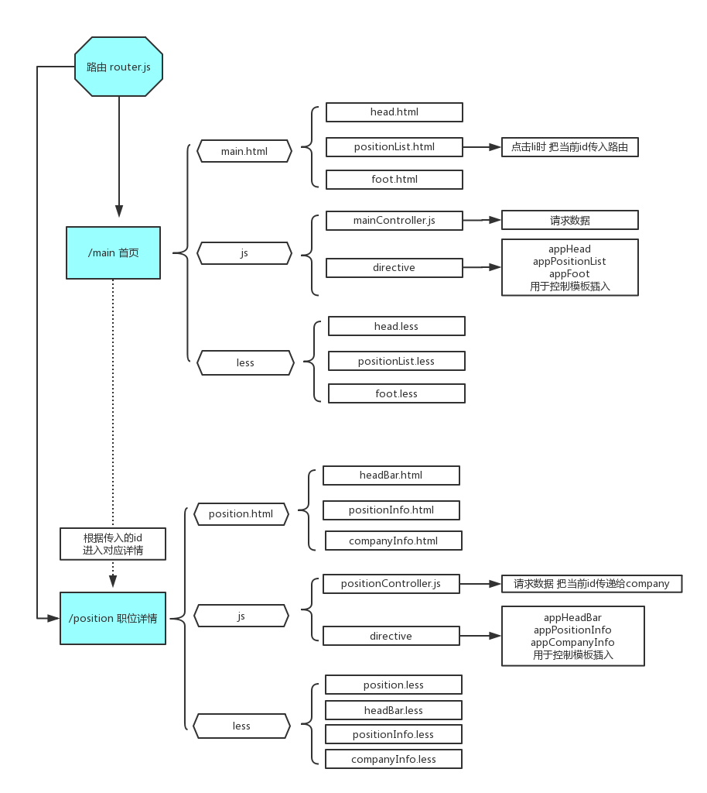

# webapp-lagou

## 环境搭建

- 安装node环境 全局安装npm和bower
- 初始化一个仓库`git init` 
- 初始化配置文件  `npm init`  `bower init` (cmd环境)

## 安装工具包

- 安装  `angularjs`  `ui-router`
- 安装 `gulp-htmlmin/less/cssmin/concat/uglify/imagemin/clean/connect/load-plugins/open`
- 构建自动化工具 编写gulpfile 并创建文件夹 文件 测试

## 流程图

## 配置首页 main.html

- 包含 `head.html` `foot.html` `positionList.html`
- 在index.html中引入angular和ui-router框架
- 创建首页路由模块 配置
- stateProvider.state设置主页面 urlRouterProvider.otherwise默认跳转

- [ ] ##### 添加less文件及创建模板

- 创建 颜色变量.less 公用样式 
- 创建 头部模板.html 指令文件.js 样式.less
- 创建 底部模板.html 指令文件.js 样式.less

- [ ] ##### 配置底部路由

- 设置底部跳转 ui-sref="路由"
- 创建 职位列表模板.html 指令文件.js 样式.less
- mianController 设置list默认数据 绑定到列表
- 解决同名属性问题 在positionList.js 中添加scope:{data:'='} 暴露(data)接口 当前.html中使用data
- 调用时 在指令模板写上data="scope中的属性名" 即可实现重复调用 降低指令与控制器的耦合度指令复用

## 配置职位页面 position.html

- 包含 `headBar.html` `positionInfo.html` `company.html`
- 创建职位模板 路由 职位控制器
- 职位列表 添加事件 通过ui-sref="position({id:item.id})" 跳转到对应页面
- 创建公共head bar 模板 指令 样式 

## 配置公司页面 company.html

* 创建公司模板 路由 控制器companyControll.js
* 点击公司模块跳转 ui-sref="company{{id:1}}"
* 包含 `headBar.html` `positionInfo.html` `positionClass.html`
* 开发positionClass指令 创建positionClass样式文件并引入index.less

## 动态获取数据

* 从data.json中获取数据，动态添加到页面
* mainController 中注入$http 使用get方法获取 把响应的数据赋值给scope.list
* positionInfo职位详情中的收藏设置为登录后显示 未登录时投简历显示为去登录 ng-show="isLogin" positionInfo中isLogin: "=" 
* ng-bind="isLogin?'投个简历':'去登录'"
* 在positionController中注入$http 获取数据加载到页面